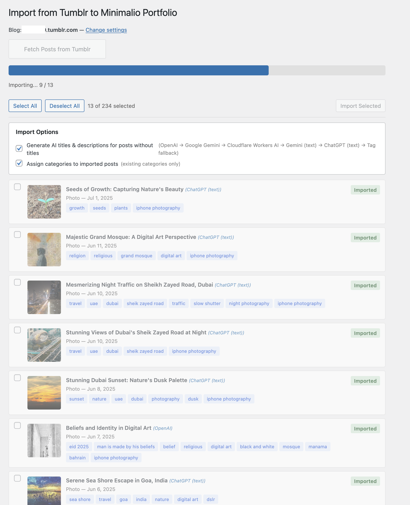

# Tumblr to Minimalio Portfolio

A WordPress plugin that imports photos and videos from a Tumblr blog into the [Minimalio Portfolio](https://minimalio.org/premium-plugin/) custom post type, with AI-powered SEO title, description, and category generation.

## Features

- **Tumblr Import** — Fetch and selectively import photo, video, and text posts from any public Tumblr blog.
- **Image Sideloading** — Downloads Tumblr images into your WordPress media library and sets them as featured images.
- **Smart Image Handling** — Single image posts get a featured image only; multi-image posts get the first as featured and the rest as Gutenberg gallery blocks.
- **Video Support** — Embeds Vimeo and other video posts with proper Gutenberg embed blocks.
- **Duplicate Detection** — Skips posts that have already been imported.
- **Resume Import** — If the browser is closed mid-import, the fetched post list is restored on the next visit so you can continue where you left off.
- **Tag Preservation** — Maps Tumblr tags to Portfolio Tags taxonomy.
- **Original Date** — Preserves the original Tumblr post date.
- **Post Status** — Choose to import posts as Published (live immediately) or Draft (review first).
- **Post Author** — Assign all imported posts to a specific WordPress user.

### AI-Powered SEO Generation

When enabled, the plugin uses AI to generate SEO-optimized metadata for imported posts:

- **SEO Title** — max 60 characters, concise and descriptive
- **SEO Description** — max 254 characters, engaging meta description
- **Image Alt Text** — max 125 characters, AI-generated for accessibility

The AI system uses a **three-tier failover chain**:

1. **Vision AI** (image + tags) — Sends the image to an AI vision model for the highest quality results.
   - **OpenAI** (GPT-4o-mini) — Pay-per-use (~$0.001/image). Highest quality.
   - **Google Gemini** — Free tier: 15 req/min, 1,500/day. Great balance of quality and cost.
   - **Cloudflare Workers AI** (LLaVA) — Free tier: ~100–200 images/day.

2. **Text AI** (tags only) — If vision AI fails or is rate-limited, sends only the post tags to generate titles. Fast, cheap, and still AI quality.
   - **ChatGPT (text)** — Reuses your OpenAI API key. ~$0.0001/request.
   - **Gemini (text)** — Reuses your Gemini API key. Free.

3. **Tag Fallback** (no AI) — Last resort. Builds a title from tags using simple concatenation rules.

### AI Category Assignment

- Assign categories to imported posts using AI.
- Choose between using existing categories only or allowing the AI to create new ones.

## Requirements

- WordPress 5.8+
- PHP 7.4+
- [Minimalio Portfolio](https://minimalio.org/premium-plugin/) plugin (must be active)
- A [Tumblr API key](https://www.tumblr.com/oauth/apps) (free)
- **For AI SEO generation (optional)** — at least one of the following:
  - [OpenAI API key](https://platform.openai.com/api-keys) (pay-per-use, also powers ChatGPT text fallback)
  - [Google Gemini API key](https://aistudio.google.com/apikey) (free tier available, also powers Gemini text fallback)
  - [Cloudflare Workers AI](https://dash.cloudflare.com) account ID + API token (free tier available)

## Installation

1. Download or clone this repository into your `wp-content/plugins/` directory.
2. Activate the **Minimalio Portfolio** plugin first.
3. Activate **Tumblr to Minimalio Portfolio**.
4. Go to **Tools → Import → Tumblr to Minimalio Portfolio**.

## Configuration

### Tumblr API

1. Go to [tumblr.com/oauth/apps](https://www.tumblr.com/oauth/apps) and register an application.
2. Copy the **OAuth Consumer Key** (this is your API key).
3. Enter it on the plugin settings page along with your Tumblr blog URL.

### AI Services (Optional)

Configure one or more AI services to enable SEO generation:

- **Google Gemini** — Get a free API key from [aistudio.google.com/apikey](https://aistudio.google.com/apikey).
- **OpenAI** — Get an API key from [platform.openai.com/api-keys](https://platform.openai.com/api-keys).
- **Cloudflare Workers AI** — Log in to [dash.cloudflare.com](https://dash.cloudflare.com), find your Account ID in the sidebar, and create an API Token at **My Profile → API Tokens** with `Account.Workers AI:Read` permission.

### Service Priority

Drag and drop the AI service cards on the settings page to set the failover priority. The order determines which service is tried first. If it fails or is rate-limited, the next service in the chain is used.

### Import Settings

- **Post Status** — Choose between `Published` (posts go live immediately) or `Draft` (review before publishing).
- **Post Author** — Select which WordPress user the imported posts should be assigned to.

## Usage

1. Go to **Tools → Import → Tumblr to Minimalio Portfolio**.
2. Configure your settings and click **Save Settings & Continue**.
3. Click **Fetch Posts from Tumblr** to load available posts.
4. Select the posts you want to import.
5. Click **Import Selected**.

## Screenshots

### Settings Page

The initial settings page under **Tools → Import**. Enter your Tumblr blog URL and OAuth Consumer Key. Enable AI-powered SEO generation to automatically generate titles and descriptions for imported posts.

### AI Service Configuration

The full settings page with AI enabled. Configure one or more AI services — drag to reorder the failover priority. Each service card shows its pricing tier (Free/Paid) and includes a **Test** button to verify your API key. The **Text-Only AI Fallback** section shows services that generate titles from tags when vision AI is unavailable. The **AI Category Assignment** section lets you control how categories are assigned. The current failover chain is displayed at the bottom.

### Import in Progress

The import page showing posts being imported with AI-generated titles. Each post displays its thumbnail, AI-generated title, the AI service that generated it (shown in blue, e.g., *OpenAI*, *ChatGPT (text)*), tags, and import status. The **Import Options** panel shows the full failover chain. Use the **Posts** and **Import Log** tabs to switch between the post list and detailed import log.

## License

This plugin is licensed under the [GPL-2.0-or-later](https://www.gnu.org/licenses/gpl-2.0.html).

## Author

**Sriram Govindan** — [GitHub](https://github.com/marirs/tumblr-to-minimalio-portfolio)
